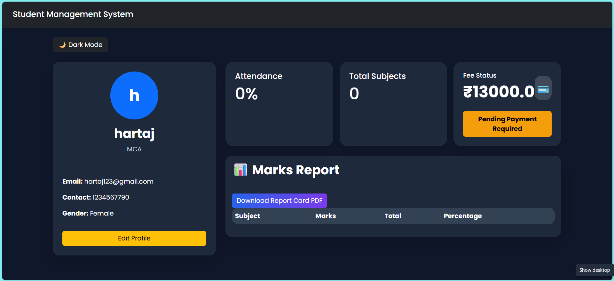
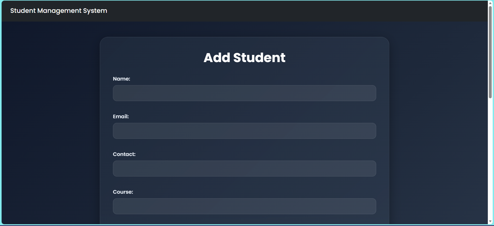
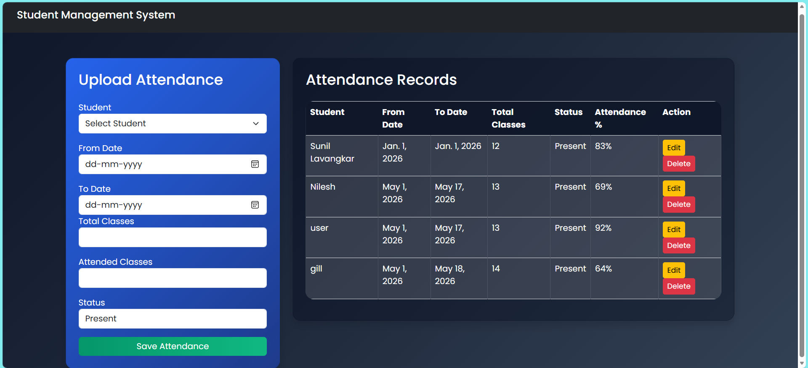
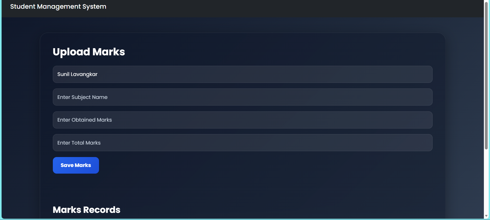
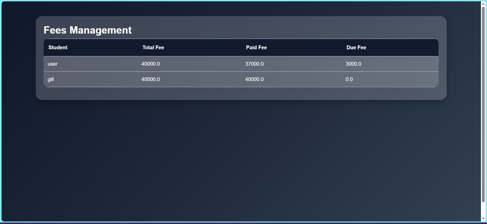

# 🎓 Student Management System

A web-based Student Management System developed using Django and SQL Server. The system allows administrators to manage students, attendance, marks, fees, and user accounts, while students can securely log in to view their academic information.

---

## 🚀 Features

### 👨‍💼 Admin Module
- Admin Login
- Add, Edit & Delete Students
- Student Approval System
- Upload Student Marks
- Manage Attendance
- Manage Fees
- View Student Records
- Dashboard

### 👨‍🎓 Student Module
- Secure Login
- View Profile
- Edit Profile
- View Attendance
- View Marks
- Download Report Card (PDF)
- View Fee Status
- Dark/Light Mode

---

## 🛠️ Technologies Used

- Python
- Django
- HTML5
- CSS3
- Bootstrap 5
- JavaScript
- SQL Server
- ReportLab (PDF Generation)

---

## 📂 Project Structure

```
sms_project/
│
├── sms_app/
├── templates/
├── media/
├── static/
├── manage.py
├── requirements.txt
└── db.sqlite3 (or SQL Server Database)
```

---

## ⚙️ Installation

### Clone Repository

```bash
git clone https://github.com/LalitKatre4/student-management-project.git
```

### Go to Project

```bash
cd student-management-system-project
```

### Create Virtual Environment

```bash
python -m venv .venv
```

### Activate Environment

Windows

```bash
.venv\Scripts\activate
```

### Install Dependencies

```bash
pip install -r requirements.txt
```

### Run Server

```bash
python manage.py runserver
```

---

## 📸 Screenshots

## Admin Dashboard


## Student Dashboard



## Add Student



## Attendance



## Marks



## Fees Management



---

## 👨‍💻 Author

Lalit Katre

GitHub:
https://github.com/LalitKatre4

LinkedIn:
https://www.linkedin.com/in/lalit-katre/

---

## 📄 License

This project is developed for educational purposes.# student-management-system-project
